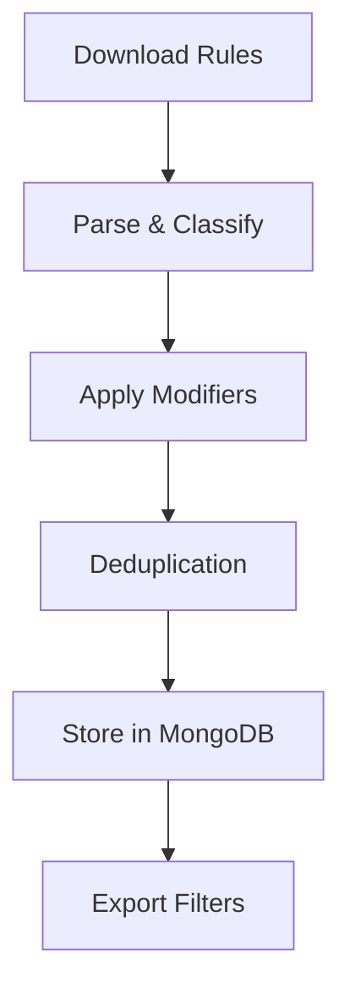

<div align="center">
  

# Blockingmachine

[](https://github.com/greigh/blockingmachine-cli/actions)
[](https://github.com/greigh/Blockingmachine-CLI/releases)
[](https://github.com/greigh/blockingmachine-cli/graphs/commit-activity)
[](https://github.com/greigh/blockingmachine-cli/issues)
[](LICENSE)
[](https://www.npmjs.com/package/@blockingmachine/cli)
[](https://www.npmjs.com/package/@blockingmachine/cli)
[](https://github.com/greigh/blockingmachine-cli)

_Lists Last Updated: April 26, 2025_

</div>

## Description

Blockingmachine CLI is a powerful command-line tool that streamlines the process of collecting, analyzing, and exporting ad-blocking and privacy filter lists. It aggregates rules from multiple trusted sources, intelligently deduplicates entries, categorizes blocking rules, and exports to various formats including AdGuard, hosts files, dnsmasq, and more. Designed for flexibility, the tool allows for custom filtering by category, priority, and tags, enabling both automated workflows and personalized filter list creation.

### Related Projects
- [Blockingmachine Core](https://github.com/greigh/blockingmachine-core) - Core functionality library
- [Blockingmachine Desktop](https://github.com/greigh/Blockingmachine) - Desktop application for managing filter lists

---

## Quick Start
```bash
# Install globally
npm install -g @blockingmachine/cli

# Create a new configuration
blockingmachine init

# Import and export rules
blockingmachine import
blockingmachine export adguard
```

## Timeline

### Current Release (v1.0.0-beta.3)
- 🚀 Full integration with @blockingmachine/core
- 💪 TypeScript support
- 📥 Multiple source list support
- 🔄 Rule categorization and filtering
- ⚡ Multi-format export capabilities
- ✅ Advanced configuration options
- 🐞 Bug fixes and performance improvements

### Upcoming Features (v1.0.0)
- 📊 Enhanced statistics and reporting
- 🔍 Improved pattern matching and rule validation
- 📋 Support for additional export formats
- 🌐 Better network resilience and retry logic
- 🎯 Rule optimization commands
- 📦 Smaller installation footprint
- 🧪 Extended test coverage

### Future Roadmap (v1.x+)
- 🔄 Streaming processing for large rule sets
- 🌍 Internationalization support
- 🔒 Enhanced security features
- 📈 Performance optimizations
- 🧩 Plugin system for custom rule processors
- 🤝 Third-party service integrations
- 🛠️ Advanced debugging and troubleshooting tools

### Version History

#### 1.0.0-beta.3 (Current)
- Added parallel processing capabilities
- Fixed MongoDB connection handling issues
- Added more comprehensive export formats
- Improved command-line argument parsing
- Enhanced logging and error reporting
- Fixed NPM packaging issues

#### 1.0.0-beta.2
- Added support for multiple export formats
- Enhanced configuration options
- Improved rule categorization
- Fixed dependency resolution issues
- Optimized database operations

#### 1.0.0-beta.1
- Initial public release
- Core commands (import/export) stable
- Basic documentation
- Essential features implemented

#### 0.9.0 (Internal)
- Feature complete CLI
- Internal testing and validation
- Performance optimization
- Documentation drafting

#### 0.5.0 (Development)
- Command structure implementation
- Basic feature development
- Initial testing setup

## Features

### Enhanced Rule Processing
- **Smart Rule Classification**: Automatically detects and categorizes rules:
  - Domain-based blocking rules
  - Regular expression patterns
  - Exception rules
  - Cosmetic filters
- **Mobile-Specific Detection**: Identifies mobile-specific rules using patterns:
  - App store URLs
  - Mobile domains
  - App-specific patterns
  - Platform-specific rules

### Advanced Filtering
- **Category-Based Management**:
  ```bash
  blockingmachine export --categories privacy,security
  blockingmachine export --exclude advertising,gaming
  ```
- **Priority System**:
  ```bash
  blockingmachine export --min-priority 80
  ```
- **Tag-Based Filtering**:
  ```bash
  blockingmachine export --tags mobile,trusted
  ```

### Multiple Export Formats
- **DNS-Based Formats**:
  - Hosts files (`hosts`)
  - dnsmasq configuration (`dnsmasq`)
  - Unbound configuration (`unbound`)
  - BIND configuration (`bind`)
- **Browser-Based Formats**:
  - AdGuard (`adguard`)
  - ABP format (`abp`)
- **Application-Specific**:
  - Privoxy rules (`privoxy`)
  - Shadowrocket configuration (`shadowrocket`)

### Database Management
```bash
# Import and process rules
blockingmachine import

# View database statistics
blockingmachine view
blockingmachine view --sample 10

# Run database migrations
blockingmachine migrate

# Clean up and maintenance
blockingmachine cleanup
blockingmachine cleanup --drop  # Development only
```

### Configuration
```json
{
  "mongodb": {
    "uri": "mongodb://localhost:27017/blockingmachine",
    "options": {
      "maxPoolSize": 10
    }
  },
  "output": {
    "directory": "./filters/output"
  },
  "sources": [
    {
      "name": "EasyPrivacy",
      "url": "https://easylist.to/easylist/easyprivacy.txt",
      "category": "privacy",
      "enabled": true,
      "priority": 90
    }
  ]
}
```

### Logging and Debugging
- **Detailed Logging**:
  ```bash
  blockingmachine --debug import
  ```
- **Log Files**:
  - `logs/error.log`: Error-level messages
  - `logs/combined.log`: All log levels

### Rule Processing Pipeline


### Performance Optimization
- **Caching System**:
  ```bash
  # Enable caching in .blockingmachinerc.json
  {
    "caching": {
      "enabled": true,
      "ttl": 3600,
      "maxSize": "100mb"
    }
  }
  ```
- **Batch Processing**: Rules are processed in configurable batch sizes
- **Parallel Processing**: Multi-threaded rule processing for better performance

### Error Handling
```bash
# View detailed error logs
blockingmachine --debug import

# Check rule validation errors
blockingmachine validate --fix
```

### Contributing
- **Setting up the development environment**:
  ```bash
  # Fork and clone the repository
  git clone https://github.com/yourusername/blockingmachine-cli.git
  
  # Install dependencies
  cd blockingmachine
  npm install
  
  # Run tests
  npm test
  
  # Start in development mode
  npm run dev
  ```

- **Running Tests**:
  ```bash
  # Run all tests
  npm test
  
  # Run specific test suite
  npm test -- --grep "rule processing"
  
  # Run with coverage
  npm run test:coverage
  ```

### Environment Variables
```bash
# Development mode
NODE_ENV=development

# MongoDB configuration
MONGODB_URI=mongodb://localhost:27017/blockingmachine
MONGODB_MAX_POOL_SIZE=10

# Logging
LOG_LEVEL=debug
LOG_FORMAT=pretty

# Feature flags
ENABLE_CACHING=true
ENABLE_PARALLEL_PROCESSING=true
```

### Troubleshooting

#### Common Issues
1. **MongoDB Connection Issues**
   ```bash
   # Check MongoDB status
   brew services list | grep mongodb
   
   # Start MongoDB if needed
   brew services start mongodb-community
   ```

2. **Permission Issues**
   ```bash
   # Fix output directory permissions
   chmod 755 ./filters/output
   ```

3. **Memory Issues**
   ```bash
   # Increase Node.js memory limit
   export NODE_OPTIONS="--max-old-space-size=4096"
   ```

### API Documentation

#### Command Context
```typescript
interface CommandContext {
  config: AppConfig;
  debug: boolean;
  logger: Logger;
}
```

#### Export Options
```typescript
interface ExportOptions {
  formats?: SupportedFormat[];
  categories?: string[];
  excludeCategories?: string[];
  minPriority?: number;
  tags?: string[];
  outputPath?: string;
}
```

### Security

- All downloaded content is validated and sanitized
- HTTPS-only for rule downloads
- Input validation for all command parameters
- Safe file system operations

Please read our Contributing Guide for more details.

### Code Style

We use ESLint and Prettier to maintain code quality. Before submitting a pull request:

```bash
# Run linter
  npm run lint

  # Fix linting issues automatically
  npm run lint:fix
```

### Technology Stack

- **Electron**: Cross-platform desktop application framework
- **React**: UI library for building interactive interfaces
- **TypeScript**: Type-safe JavaScript
- **Recharts**: Responsive charting library
- **Electron Store**: Persistent settings storage
- **@blockingmachine/core**: Core rule processing functionality

## License
This project is licensed under the BSD-3-Clause License.

<div align="center"> Made with ❤️ by <a href="https://danielhipskind.com/">Daniel Hipskind</a> </div>