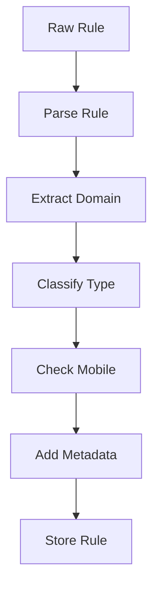

# Rule Processing Guide

## Overview

BlockingMachine processes filter rules through several stages:
1. Download and parsing
2. Classification and validation
3. Mobile detection
4. Deduplication
5. Storage and indexing

## Rule Types

### Supported Rule Formats

```adblock
# Basic blocking rules
||example.com^
||ads.example.com^$third-party

# Exception rules
@@||example.com/assets/
@@||cdn.example.com^$image

# Cosmetic filters
example.com##.ad-container
example.com#@#.social-share

# Extended syntax
example.com#$#hide-if-contains 'sponsored'
example.com#$#abort-current-inline-script jQuery
```

### Rule Classification

Rules are automatically classified into types:

```typescript
type RuleType =
  | 'blocking'     // ||example.com^
  | 'unblocking'   // @@||example.com^
  | 'cosmetic'     // ##.ad-container
  | 'scriptlet'    // #$#abort-on-property-read
  | 'extended-css' // :has(.ad)
```

## Mobile Detection

### Mobile Patterns
```typescript
const mobilePatterns = [
  /mobile|android|ios|app|tablet/i,
  /com\.(google|android|huawei|xiaomi|oppo|vivo|samsung)/,
  /\.(apk|ipa|app)$/,
  /play\.google\.com|apps\.apple\.com/
];
```

### Example Rules
```adblock
# Automatically tagged as mobile
||ads.gaming.app^
||play.google.com/store/apps/*$third-party
||m.example.com/ads^
```

## Rule Processing

### Basic Flow


### Command Usage
```bash
# Process rules with default settings
blockingmachine import

# Process with specific options
blockingmachine import --batch-size 1000 --parallel 4

# Process with mobile detection
blockingmachine import --detect-mobile
```

## Rule Modification

### Adding Modifiers
```adblock
# Original rule
||example.com^

# With modifiers
||example.com^$third-party
||example.com^$script,xhr
||example.com^$domain=example.org
```

### Domain Extraction
```typescript
function extractDomain(rule: string): string | undefined {
  // Remove exception markers
  rule = rule.replace(/^@@/, '');
  
  // Handle domain-specific rules
  if (rule.startsWith('||')) {
    return rule.slice(2).split(/[/:^]/)[0];
  }
  
  return undefined;
}
```

## Rule Storage

### MongoDB Schema
```typescript
interface StoredRule {
  raw: string;          // Original rule text
  type: RuleType;       // Classification
  domain?: string;      // Extracted domain
  hash: string;         // Unique identifier
  metadata: {
    sources: string[];  // Rule sources
    dateAdded: Date;    // First seen
    lastUpdated: Date;  // Last modification
    enabled: boolean;   // Active status
  };
  variants?: Array<{    // Rule variations
    rule: string;       // Variant text
    source: string;     // Variant source
    dateAdded: Date;    // When added
    modifiers: RuleModifier[];
  }>;
}
```

## Performance Optimization

### Batch Processing
```json
{
  "performance": {
    "processing": {
      "batchSize": 1000,
      "parallel": 4,
      "timeout": 30000
    }
  }
}
```

### Caching
```json
{
  "performance": {
    "caching": {
      "enabled": true,
      "ttl": 3600,
      "maxSize": "100mb"
    }
  }
}
```

## Validation

### Rule Validation
```bash
# Validate specific rules
blockingmachine validate --rules ./custom-rules.txt

# Show validation details
blockingmachine validate --verbose

# Fix common issues
blockingmachine validate --fix
```

### Common Validation Issues
```adblock
# Invalid: Missing domain
/ads/

# Valid: With domain
||example.com/ads/

# Invalid: Incorrect syntax
|http://example.com

# Valid: Correct syntax
||example.com^
```

## Examples

### Custom Rule Processing
```typescript
import { processRule } from '@blockingmachine/core';

const rule = '||example.com^$third-party';
const result = processRule(rule, {
  detectMobile: true,
  extractDomain: true,
  validate: true
});

console.log(result);
/*
{
  raw: '||example.com^$third-party',
  type: 'blocking',
  domain: 'example.com',
  modifiers: [{ type: 'third-party' }],
  isMobile: false
}
*/
```

For more examples, see [EXAMPLES.md](../EXAMPLES.md).